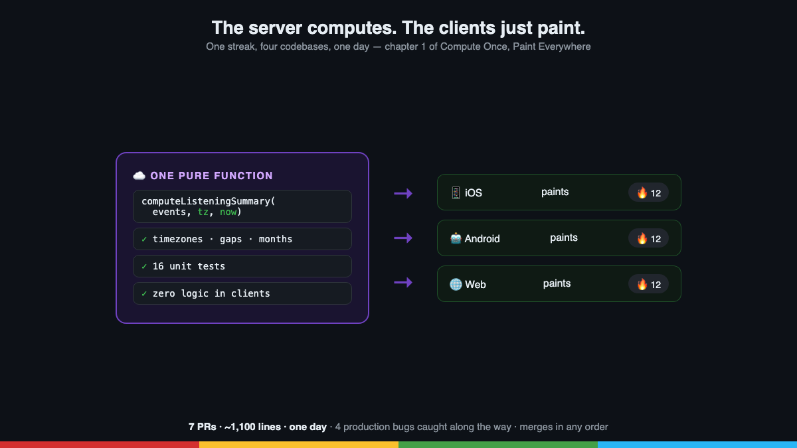

# Post 1 — The Pattern

*Chapter 1 of the series. Published on LinkedIn; canonical copy here.*

---

## English

**One feature. Four codebases. One day.**

Last week at AudioRel we shipped a unified listening streak (Duolingo's 🔥, but for children's audiobooks): backend + iOS + Android + web, with a monthly calendar and marketing attributes kept in sync.

The interesting part isn't the feature. It's the architecture that made it possible, which we've named **Compute Once, Paint Everywhere**:

🧠 **The server computes, the clients paint.**
All streak logic (timezones, gaps, navigable months) lives in ONE pure function on the backend, with 16 tests. The three clients just receive numbers and render them. Zero duplicated logic = zero drift between platforms.

📄 **Contract-first.**
Before touching a single client, the endpoint is designed and verified with curl against production. The contract is the spec; the clients are mirrors.

🪂 **Graceful degradation.**
Every client works even if the backend hasn't deployed yet. Merges are decoupled from deploys: four PRs that can land in any order without breaking anything.

🤖 **Agentic delivery.**
One AI agent (Claude Code) moved all four repos in parallel: Kotlin, Swift, TypeScript and Node in the same session, holding the same contract in its head.

The human code review? It caught 3 locale bugs the AI had introduced across all 3 clients (Buddhist calendar on iOS 🙃, Eastern Arabic digits on Android, a UTC merge bug on web). Lesson burned in: **protocol material always uses a fixed locale** — and human review remains the multiplier, not the bottleneck.

The pattern is now codified as an internal playbook: every new cross-platform feature runs on the same rails.

How do you keep platform parity in your teams?

---

## Español

**Una feature. Cuatro codebases. Un día.**

La semana pasada lanzamos en AudioRel una racha de escucha unificada (el 🔥 de Duolingo, pero para cuentos infantiles): backend + iOS + Android + web, con calendario mensual y atributos de marketing sincronizados.

Lo interesante no es la feature. Es la arquitectura que lo hizo posible, que hemos bautizado **Compute Once, Paint Everywhere**:

🧠 **El servidor calcula, los clientes pintan.** La lógica de racha (zonas horarias, huecos, mes navegable) vive en UNA función pura en el backend, con 16 tests. Los tres clientes solo reciben números y los pintan. Cero lógica duplicada = cero divergencia entre plataformas.

📄 **Contract-first.** Antes de tocar un solo cliente, el endpoint se diseña y verifica con curl contra producción. El contrato es la especificación; los clientes son espejos.

🪂 **Degradación elegante.** Cada cliente funciona aunque el backend aún no haya desplegado. Los merges se desacoplan de los deploys: cuatro PRs que aterrizan en cualquier orden sin romper nada.

🤖 **Entrega agéntica.** Un agente de IA (Claude Code) movió los cuatro repos en paralelo: Kotlin, Swift, TypeScript y Node en la misma sesión, con el mismo contrato en la cabeza.

¿La code review humana? Cazó 3 bugs de locale que la IA introdujo en los 3 clientes (calendario budista en iOS 🙃, dígitos árabes en Android, merge UTC en web). Lección a fuego: **material de protocolo siempre con locale fijo** — y la review humana sigue siendo el multiplicador, no el cuello de botella.

El patrón ya está codificado como playbook interno: cada nueva feature cross-platform sigue el mismo raíl.

¿Cómo mantenéis la paridad entre plataformas en vuestros equipos?
