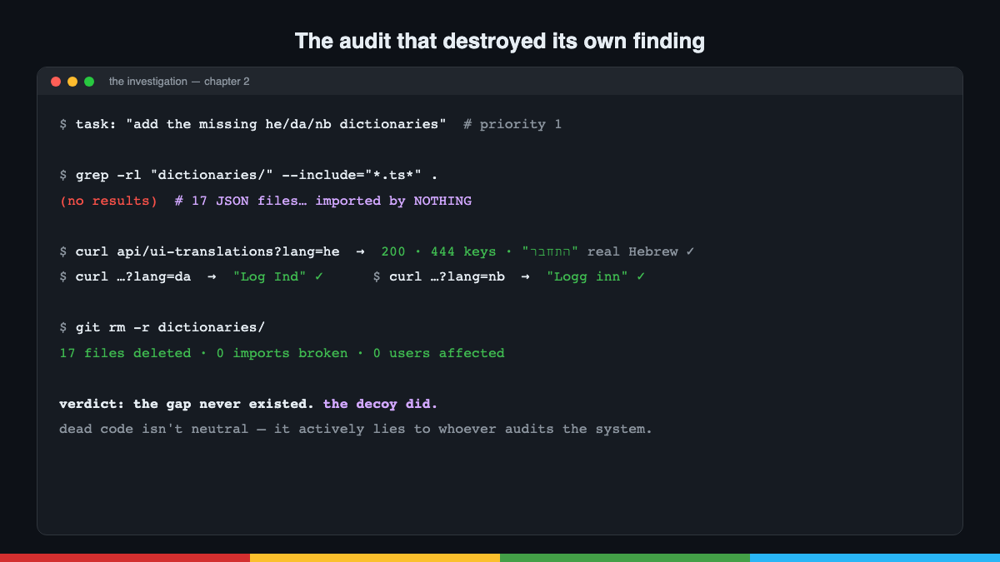

# Post 2 — The Audit That Destroyed Its Own Finding

*Chapter 2 of the series. Published on LinkedIn; canonical copy here.*

---

## English

**I asked the AI to close an i18n gap. It discovered the gap didn't exist.**

Chapter two of the **DOPE** series at AudioRel.

Context: we serve children's stories in 20 languages. An architecture audit flagged that our web app was missing the Hebrew, Danish and Norwegian dictionaries — our 2026 expansion markets. Priority 1: add them.

The agent started implementing… and stopped. Something didn't add up:

🔍 The `dictionaries/` directory had 17 JSON files (3 languages missing). But tracing the imports: **not a single module used them**. Not one.

🔍 The actual loader fetches translations from the backend API: 444 keys × 20 languages, Hebrew/Danish/Norwegian included. Verified in production: התחבר, Log Ind, Logg inn. Real translations.

🔍 The 17 JSONs were a fossil: an old version of the system, stale (~350 keys), that had been acting as a decoy for months. It fooled the AI's audit. It would have fooled any human just the same.

**The deliverable wasn't adding code. It was a deletion PR** + a header comment documenting where the truth lives ("if you need to touch a UI translation, it's in the backend, not here").

And the second deliverable was NOT building something: we have a script that generates Android's strings from iOS's, and the temptation was to clone it for web. Verdict: unnecessary — the web already has its own complete pipeline. The best tool is the one you don't have to maintain.

Three lessons:

1️⃣ Dead code isn't neutral: it **actively lies** to whoever audits the system.
2️⃣ An AI that verifies its own findings against production before implementing is worth twice one that just follows orders.
3️⃣ Sometimes the best PR removes lines.

How much dead code is lying to your audits right now?

---

## Español

**Le pedí a la IA que cerrara un hueco de i18n. Descubrió que el hueco no existía.**

Segundo capítulo de la serie **DOPE** en AudioRel.

Contexto: servimos cuentos en 20 idiomas. Una auditoría de arquitectura señaló que a la web le faltaban los diccionarios de hebreo, danés y noruego — nuestros mercados de expansión 2026. Prioridad 1: añadirlos.

El agente empezó a implementar… y frenó. Algo no cuadraba:

🔍 El directorio `dictionaries/` tenía 17 JSONs (faltaban 3 idiomas). Pero al rastrear los imports: **ningún módulo los usaba**. Ni uno.

🔍 El loader real carga las traducciones del API del backend: 444 claves × 20 idiomas, hebreo/danés/noruego incluidos. Verificado en producción: התחבר, Log Ind, Logg inn. Traducciones reales.

🔍 Los 17 JSONs eran un fósil: una versión antigua del sistema, desactualizada (~350 claves), que llevaba meses actuando de señuelo. Engañó a la auditoría de la IA. Habría engañado igual a cualquier humano.

**El deliverable no fue añadir código. Fue un PR de borrado** + un comentario que documenta dónde vive la verdad.

Y el segundo entregable fue NO construir algo: la tentación era clonar para la web el script que genera los strings de Android desde iOS. Veredicto: innecesario — la web ya tiene su pipeline. La mejor herramienta es la que no tienes que mantener.

Tres lecciones:

1️⃣ El código muerto no es neutro: **miente activamente** a quien audita el sistema.
2️⃣ Una IA que verifica sus hallazgos contra producción antes de implementar vale el doble que una que ejecuta órdenes.
3️⃣ A veces el mejor PR resta líneas.

¿Cuánto código muerto está engañando ahora mismo a vuestras auditorías?
