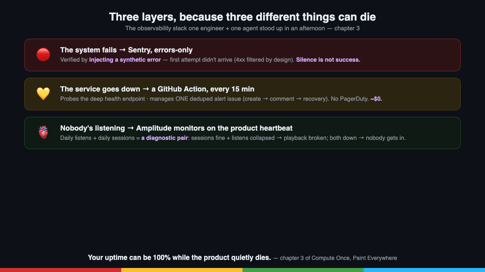

# Post 3 — The Heartbeat

*Chapter 3 of the series. Published on LinkedIn; canonical copy here.*

---

## English

**Your uptime is 100%. Is anyone listening?**

Chapter three of the **Compute Once, Paint Everywhere** series at AudioRel.

Yesterday one engineer + one AI agent stood up a complete observability stack for a production platform (backend + iOS + Android + web) in a single afternoon. Three layers, because three different things can die:

🔴 **The system fails** → Sentry, errors-only.
The agent wired the SDK, set the secret on the host, and then did the thing most teams skip: **it verified by injecting a synthetic error**. First attempt didn't show up — turned out the SDK filters client 4xx noise by design. Silence is not success; we only trusted the pipeline after watching a fake error travel end-to-end into the alert email.

💛 **The service goes down** → a GitHub Action probing the deep health endpoint every 15 minutes, managing ONE deduped alert issue (create → comment → recovery note). No PagerDuty. Cost: ~$0.

🫀 **Nobody's listening** → the layer almost everyone skips. Uptime can be 100% while the product quietly dies. So: Amplitude monitors on the *product heartbeat* — daily listens and daily sessions — built by the agent through Amplitude's MCP. The pair is diagnostic: sessions fine + listens collapsed = playback is broken; both collapsed = nobody can get in.

The part I'm most proud of? **What we didn't build:**

1️⃣ The acquisition monitor died on contact with data: 2 sign-ups in 30 days. You can't monitor a number that small — the useful "alert" there is growth work, not tooling. A metric you can't monitor is telling you something louder than any alert.

2️⃣ Per-PR mobile E2E died on contact with pricing: macOS runners bill 10× minutes on private repos. One smoke run per iOS PR would eat the month's CI quota. It shipped as manual-dispatch instead — run before releases, not on every commit.

The method, same as every chapter: **decide with data → build → verify by forcing a failure → document while it's warm.**

Playbook + skill, open source (link in comments).

What's watching YOUR product's heartbeat — or just its pulse?

---

## Español

**Tu uptime es 100%. ¿Hay alguien escuchando?**

Tercer capítulo de la serie **Compute Once, Paint Everywhere** en AudioRel.

Ayer un ingeniero + un agente de IA levantaron el stack de observabilidad completo de una plataforma en producción (backend + iOS + Android + web) en una tarde. Tres capas, porque pueden morir tres cosas distintas:

🔴 **El sistema falla** → Sentry, solo errores.
El agente cableó el SDK, puso el secreto en el host, y luego hizo lo que casi todos los equipos se saltan: **verificó inyectando un error sintético**. El primer intento no llegó — resultó que el SDK filtra el ruido 4xx de cliente por diseño. El silencio no es éxito; solo nos fiamos del pipeline tras ver un error falso viajar de punta a punta hasta el email de alerta.

💛 **El servicio se cae** → una GitHub Action sondeando el healthcheck profundo cada 15 minutos, gestionando UNA issue de alerta con dedupe (crear → comentar → nota de recuperación). Sin PagerDuty. Coste: ~0€.

🫀 **Nadie está escuchando** → la capa que casi todo el mundo se salta. El uptime puede ser 100% mientras el producto muere en silencio. Así que: monitores de Amplitude sobre el *latido del producto* — escuchas diarias y sesiones diarias — construidos por el agente vía el MCP de Amplitude. El par es diagnóstico: sesiones bien + escuchas hundidas = el playback está roto; ambas hundidas = nadie puede entrar.

¿De qué estoy más orgulloso? **De lo que NO construimos:**

1️⃣ El monitor de adquisición murió al tocar los datos: 2 registros en 30 días. No puedes monitorizar un número tan pequeño — la "alerta" útil ahí es trabajo de crecimiento, no tooling. Una métrica que no puedes monitorizar te está diciendo algo más alto que cualquier alerta.

2️⃣ El E2E móvil por PR murió al tocar los precios: los runners macOS facturan minutos ×10 en repos privados. Un smoke por PR de iOS se comería la cuota de CI del mes. Salió como ejecución manual — antes de cada release, no en cada commit.

El método, el de cada capítulo: **decidir con datos → construir → verificar forzando un fallo → documentar en caliente.**

Playbook + skill, open source (link en comentarios).

¿Qué vigila el latido de TU producto — o solo su pulso?
