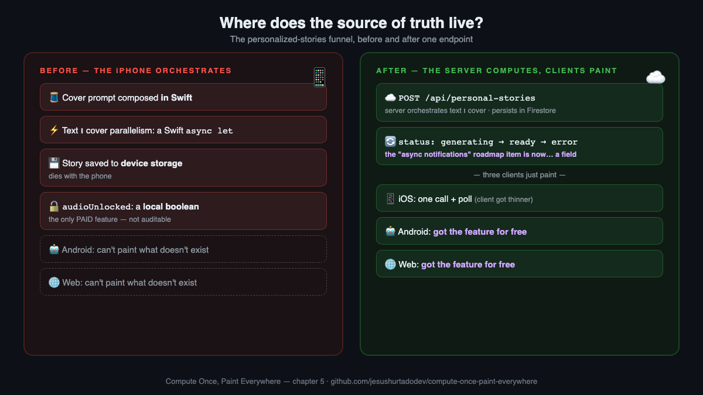
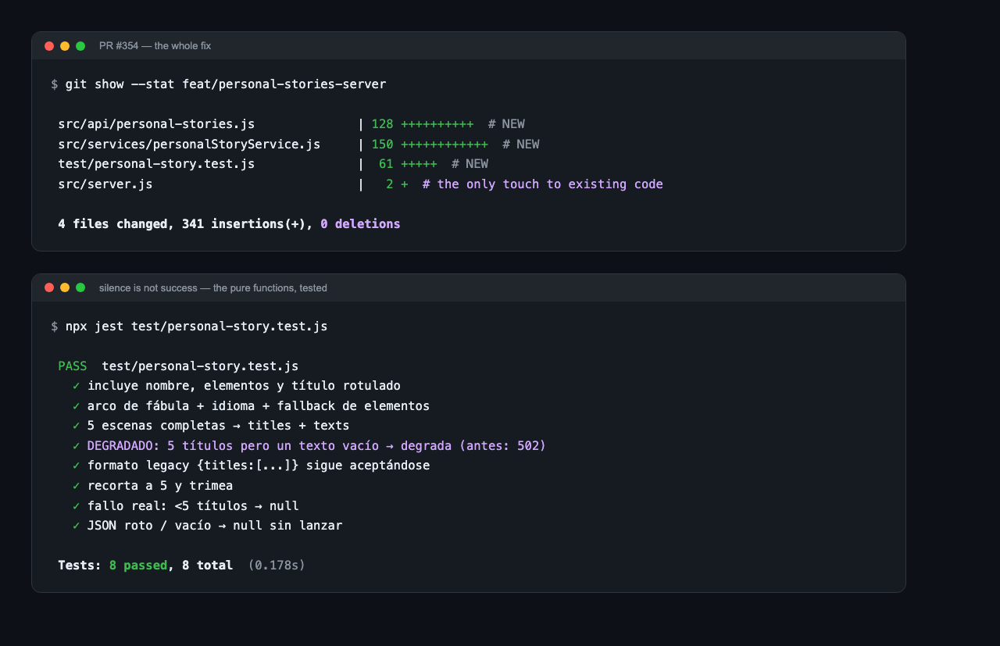

# Post 5 — "We were storing the product on a customer's iPhone" 🚧 DRAFT

> **STATUS: DRAFT** — publishes when the client PRs land and the [PENDIENTE]
> numbers are real. The scar, not the promise.

## English

**We were storing the product on a customer's iPhone.**

The fix was a refactor that ate a feature off our roadmap. Chapter five of the DOPE series at AudioRel.

Context: our iOS funnel creates personalized bedtime stories — your child's name, three magical elements, and AI writes and illustrates a story where they're the hero. It shipped fast. Parents loved it. And the AI generation ran on our servers, so we thought we were following our own pattern.

We weren't. An architecture review asked ONE question: **"Where does the source of truth live?"**

The answer was: *on the customer's iPhone.*

🔍 The prompt for the cover illustration? Composed in Swift.
🔍 The orchestration (text and cover in parallel)? A Swift `async let`.
🔍 The finished story? Saved to local device storage.
🔍 The flag that says whether the user PAID to unlock audio? A boolean. On the phone.

Nobody decided this. It grew — one pragmatic shortcut at a time, each one reasonable in isolation. That's how this class of debt always arrives: not as a decision, but as an accumulation.

The consequences were dormant but real:
- Android and web could never ship the feature — you can't paint what doesn't exist server-side
- The story dies with the device. A child's personalized story. Gone with an upgrade.
- Our ONLY paid feature's entitlement wasn't auditable by our own backend

The fix was one endpoint:

POST /api/personal-stories → the SERVER orchestrates text ∥ cover, persists with status: generating → ready

And here's my favorite part. Our roadmap had a phase 2: "build async creation notifications" — a manager, a banner, local notifications. Estimated: [PENDIENTE] days of client work.

**That feature is now a field.** `status`. Clients just paint it. The roadmap item didn't get built — it got *deleted*. The best refactors don't compete with your roadmap; they eat it.

Final tally: [PENDIENTE] PRs, [PENDIENTE] lines removed from the iOS client, Android and web got the entire funnel by just painting.

The lesson we codified (in the agent's memory, not in a human's): every feature with user state IS cross-platform, even when only one platform asks for it. The question that catches it before it ships: *where does the source of truth live?*

What's living on your users' devices right now, quietly thinking it's a database?

---

## Español

**Guardábamos el producto en el iPhone de un cliente.**

El arreglo fue un refactor que se comió una feature del roadmap. Quinto capítulo de la serie DOPE en AudioRel.

Contexto: nuestro funnel de iOS crea cuentos personalizados — el nombre de tu peque, tres elementos mágicos, y la IA escribe e ilustra un cuento donde él es el héroe. Salió rápido. A los padres les encantó. Y la generación corría en nuestros servidores, así que creíamos estar siguiendo nuestro propio patrón.

No. Una review de arquitectura hizo UNA pregunta: **"¿dónde vive la fuente de verdad?"**

La respuesta era: *en el iPhone del cliente.*

🔍 ¿El prompt de la ilustración de portada? Compuesto en Swift.
🔍 ¿La orquestación (texto y portada en paralelo)? Un `async let` de Swift.
🔍 ¿El cuento terminado? Guardado en el almacenamiento local del dispositivo.
🔍 ¿El flag que dice si el usuario PAGÓ para desbloquear el audio? Un booleano. En el teléfono.

Nadie lo decidió. Creció — un atajo pragmático cada vez, cada uno razonable por separado. Así llega siempre esta clase de deuda: no como decisión, sino como acumulación.

Las consecuencias estaban dormidas pero eran reales:
- Android y web nunca podrían tener la feature — no puedes pintar lo que no existe en el servidor
- El cuento muere con el dispositivo. El cuento personalizado de un niño. Perdido con un cambio de móvil.
- El entitlement de nuestra ÚNICA feature de pago no era auditable por nuestro propio backend

El arreglo fue un endpoint:

POST /api/personal-stories → el SERVIDOR orquesta texto ∥ portada, persiste con status: generating → ready

Y aquí mi parte favorita. El roadmap tenía una fase 2: "construir avisos asíncronos de creación" — un manager, un banner, notificaciones locales. Estimado: [PENDIENTE] días de trabajo de cliente.

**Esa feature ahora es un campo.** `status`. Los clientes solo lo pintan. La tarea del roadmap no se construyó — se *borró*. Los mejores refactors no compiten con tu roadmap; se lo comen.

Balance final: [PENDIENTE] PRs, [PENDIENTE] líneas eliminadas del cliente iOS, Android y web ganaron el funnel entero solo pintando.

La lección quedó codificada (en la memoria del agente, no en la de un humano): toda feature con estado de usuario ES cross-platform, aunque solo una plataforma la pida. La pregunta que lo caza antes de salir: *¿dónde vive la fuente de verdad?*

¿Qué vive ahora mismo en los dispositivos de tus usuarios creyéndose una base de datos?

---

# 📌 PRIMER COMENTARIO
> 🇪🇸 Versión en español 👇
> 📖 Playbook + skill, open source: https://github.com/jesushurtadodev/compute-once-paint-everywhere
> 🌐 https://jesushurtado.dev
