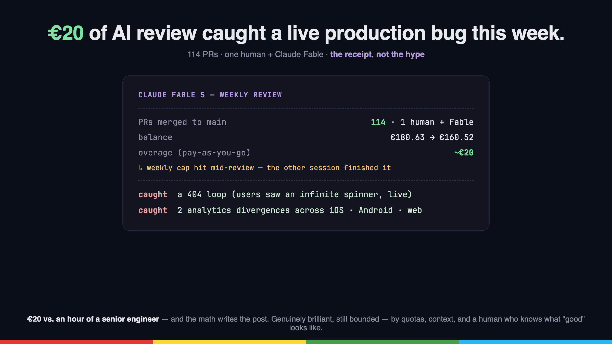

# Post especial — Los beneficios de Fable (el motor de la serie)

> Encaja como interludio de la serie (entre el post 2 y el 3, o tras el 3).
> Los números son reales y verificables a fecha 2026-07-11.

---

## English

**114 pull requests hit main this week. The engineering team is one human — and a model called Fable.**

A sidebar to the DOPE series: people keep asking what actually changed. Not "AI helps me code" — that's been true for two years. This week, with Claude Fable 5, five things were different. Each one comes with a receipt.

**1. Autonomy that survives the boring parts.**
It didn't just write features — it waited for CI, merged, watched deploys, and when a deploy silently broke (a GitHub username rename severed the pipeline), it noticed, diagnosed and routed around it. The unglamorous 80% of shipping, handled.

**2. It orchestrates itself.**
One session drove three agents in parallel: one built an entire Android feature, one rewired iOS, one shipped the web page — all against the same contract, verified with curl against production first. The rail landed as four mergeable PRs in one evening.

**3. Judgment as a deliverable.**
It refused to build things. A monitor for a metric with 2 events/month: declined, with reasoning. A code generator we "obviously" needed: declined — the pipeline already existed. My favorite PRs this week *removed* lines. An assistant that only says yes is a liability; this one says "no, and here's why."

**4. Sessions review each other.**
Two Fable sessions cross-reviewed pull requests. One caught the other emitting analytics with localized labels instead of stable IDs — "sleepy dragon" and "dragón dormilón" would never have grouped in a dashboard. That's the class of bug humans find three months later, in production, wondering why the numbers look wrong.

**5. It never learns the same lesson twice.**
Every stumble became a codified trigger — in memory files, wikis, executable skills. The pattern that got skipped once because a human forgot a command name? Now it fires automatically. Institutional memory, without the institution.

**And the honest part** — because this series doesn't do hype: mid-review, one of the two sessions hit its usage ceiling. Frozen, mid-sentence, findings half-delivered. The other session picked up its unfinished review and completed the round. That's the actual state of the art in 2026: genuinely brilliant, and still bounded — by quotas, by context, and by needing a human who knows what "good" looks like. The locale bugs it introduced across three platforms? A human review caught those.

**And the receipt — literally.** This series doesn't do hype, so here's the meter. The flat subscription (Max plan) covered the bulk of those 114 PRs. Mid-review, the weekly Fable allowance hit 100% and one session froze — frozen mid-sentence, findings half-delivered. The overage, billed pay-as-you-go, to finish the cross-platform review and apply the fixes across three codebases: **about €20** (balance €180.63 → €160.52). Twenty euros for a round that caught a real production bug — a 404 loop that would've shown users an infinite spinner — plus two analytics divergences across iOS, Android and web. That's the actual state of the art in 2026: genuinely brilliant, still bounded — by quotas, by context, by needing a human who knows what "good" looks like. The locale bugs it introduced across three platforms? A human review caught those. Now weigh €20 of overage against an hour of a senior engineer's time, and the math writes the post.

Fable didn't replace my judgment. It multiplied it by 114.

What would your week look like with a second engineer who never sleeps — and never says yes to be polite?

---

## Español

**114 pull requests han llegado a main esta semana. El equipo de ingeniería es un humano — y un modelo llamado Fable.**

Un interludio de la serie DOPE: me preguntan qué ha cambiado de verdad. No es "la IA me ayuda a programar" — eso lleva dos años siendo cierto. Esta semana, con Claude Fable 5, cinco cosas fueron distintas. Cada una con su recibo.

**1. Autonomía que sobrevive a las partes aburridas.**
No solo escribió features — esperó CIs, mergeó, vigiló deploys, y cuando un deploy se rompió en silencio (un rename de usuario de GitHub cortó el pipeline), lo notó, lo diagnosticó y lo rodeó. El 80% poco glamuroso de shippear, resuelto.

**2. Se orquesta a sí mismo.**
Una sesión dirigió tres agentes en paralelo: uno construyó una feature entera de Android, otro recableó iOS, otro sacó la página web — todos contra el mismo contrato, verificado antes con curl contra producción. El raíl aterrizó como cuatro PRs mergeables en una tarde.

**3. El criterio como entregable.**
Se negó a construir cosas. ¿Un monitor para una métrica con 2 eventos al mes? Rechazado, con argumentos. ¿Un generador de código que "obviamente" necesitábamos? Rechazado — el pipeline ya existía. Mis PRs favoritos de la semana *restan* líneas. Un asistente que solo dice sí es un pasivo; este dice "no, y te explico por qué".

**4. Las sesiones se revisan entre sí.**
Dos sesiones de Fable se cruzaron reviews de PRs. Una cazó a la otra emitiendo analytics con etiquetas localizadas en vez de IDs estables — "sleepy dragon" y "dragón dormilón" jamás habrían agrupado en un dashboard. Esa es la clase de bug que un humano encuentra tres meses después, en producción, preguntándose por qué los números no cuadran.

**5. Nunca aprende la misma lección dos veces.**
Cada tropiezo quedó codificado como trigger — en memoria, wikis, skills ejecutables. ¿El patrón que se saltó una vez porque un humano olvidó el nombre de un comando? Ahora se dispara solo. Memoria institucional, sin institución.

**Y la parte honesta** — porque esta serie no hace hype: a mitad de una ronda de review, una de las dos sesiones agotó su cupo de uso. Congelada, a media frase, con los hallazgos a medio entregar. La otra sesión recogió su review inacabada y completó la ronda. Ese es el estado del arte real en 2026: genuinamente brillante, y todavía acotado — por cuotas, por contexto, y por necesitar un humano que sepa qué aspecto tiene "bien hecho". ¿Los bugs de locale que introdujo en tres plataformas? Los cazó una review humana.

**Y el recibo — literal.** Esta serie no hace hype, así que aquí está el contador. La suscripción plana (plan Max) cubrió el grueso de esos 114 PRs. A mitad de una review, la cuota semanal de Fable llegó al 100% y una sesión se congeló — a media frase, con los hallazgos a medio entregar. El excedente, facturado por uso, para terminar la review cross-platform y aplicar los fixes en tres codebases: **unos 20 €** (saldo 180,63 € → 160,52 €). Veinte euros por una ronda que cazó un bug real de producción — un bucle de 404 que habría dejado a los usuarios con un spinner infinito — más dos divergencias de analytics entre iOS, Android y web. Ese es el estado del arte real en 2026: genuinamente brillante, todavía acotado — por cuotas, por contexto, por necesitar un humano que sepa qué aspecto tiene "bien hecho". ¿Los bugs de locale que introdujo en tres plataformas? Los cazó una review humana. Ahora pon esos 20 € de excedente frente a una hora de un ingeniero senior, y las cuentas escriben el post solas.

Fable no sustituyó mi criterio. Lo multiplicó por 114.

¿Cómo sería tu semana con un segundo ingeniero que nunca duerme — y nunca dice que sí por educación?

---

# 📌 PRIMER COMENTARIO
> 🇪🇸 Versión en español 👇
> 📖 El patrón, el playbook y los skills, open source: https://github.com/jesushurtadodev/dope-architecture
> 🌐 https://jesushurtado.dev
